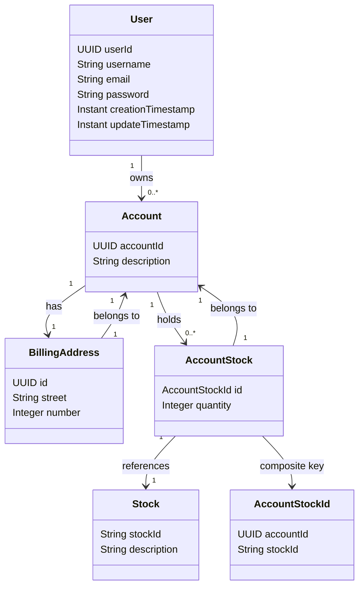

## Ferramentas e tecnologias utilizadas

- java 21;
- Spring Boot 3;
- Padrão de projeto - Repository
- DTO - cadastro e visualização das entidades;
- Testes unitarios - Junit e mockito;
- Banco de dados - MySQL e h2database;
- Armazenamento - Docker;
- Postman - Requisições do Front-end;
- intellij.

## Descrição básica
- Esta api criar um CRUD de um Back-end de uma aplicação bancaria de investimento.
- A API consome os serviços da API da Bolsa de Valores, mostrando em tempo real o valor das ações do usuário.
## Diagrama de classes

## Estrutura de pacotes do projeto

| Pacote          | Descrição                                                                |
|-----------------|--------------------------------------------------------------------------|
| controller      | Classes que gerenciam as requisições da API                              | 
| entity          | Entidades do domínio da aplicação                                        |
| repository      | Inteface de acesso a base de dados                                       |
| service         | Classes com regras de negócio                                            |
| UserServiceTest | Classes de testes Unitários da classe service                            |
| dto             | Classes exibe informações básicas da entity para inserção e visualização |

## Rotas
Users :
- Adicionar - Post: http://localhost:8080/v1/users 
- Listar - Get: http://localhost:8080/v1/users/{userId}
- Listar - Get: http://localhost:8080/v1/users 
- Editar - Put: http://localhost:8080/v1/users/{userId} 
- Apagar - Delete: http://localhost:8080/v1/users/{userId}

Accounts

- Adicionar - Post: http://localhost:8080/v1/users/{userId}/accounts
- Listar - Get: http://localhost:8080/v1/users/{userId}/accounts

Stocks

- Adicionar - Post: http://localhost:8080/v1/stocks
- Listar - Get: http://localhost:8080/v1/users/{userId}/accounts
- Associar conta e ação - Post: http://localhost:8080/v1/accounts/{accountsId}/stocks
- Listar ações - Get: http://localhost:8080/v1/accounts/{accountsId}/stocks

## Extras

### Acessar o console do h2 database 
- http://localhost:8080/h2-console

### API BRAP
- https://brapi.dev

### Link docker
- https://spring.io/guides/gs/accessing-data-mysql

### Editor json online edit
- https://jsoneditoronline.org/

